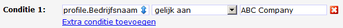

# De eenvoudige script editor

Voor het maken van eenvoudige condities kun je gebruik maken van de
eenvoudige script editor. Voor de meeste gebruikers biedt deze tool
voldoende mogelijkheden.

Met behulp van deze editor vergelijk je gegevens van het
(sub)profiel met een opgegeven waarde. Wanneer deze vergelijking naar
‘waar’ evalueert, zal de actie die er aan is verbonden worden
uitgevoerd. Dit kan dus het uitvoeren van een opvolgactie zijn, maar ook
het tonen van bepaalde inhoud in een nieuwsbrief.

Werken met de eenvoudige script editor
--------------------------------------

De eenvoudige script editor vind je in het **condities**tabblad van het
onderdeel waarvoor je de conditie wilt instellen. Voor **opvolgacties**
vind je de editor in het eindoverzicht van de opvolgactie. Voor
**webformulieren** vind je de editor in de (sub)profielen bewerken
wizard van het Content webformulier.

Klik op ‘**Gebruik de eenvoudige script editor voor condities**’ wanneer
de geavanceerde script editor wordt getoond.

Selecteer eerst het veld waaraan de conditie gekoppeld moet worden.
Vervolgens geef je aan op welke wijze er vergeleken moet worden (is
gelijk aan, is ongelijk aan, et cetera). Tot slot geef je de waarde
waarmee de waarde in het database- of collectieveld moet worden
vergeleken.

**Je kunt zoveel conditieregels toevoegen als je wilt. De totale
conditie evalueert alleen naar ‘waar’ wanneer alle ingestelde condities
naar 'waar' evalueren.**

In het volgende voorbeeld wordt een afbeelding alleen getoond aan
vrouwen uit Amsterdam

**Geslacht **[is gelijk aan] **vrouw**

**Woonplaats **[is gelijk aan] **Amsterdam**

Zou hier nog de vergelijking ‘**Leeftijd **[is hoger dan] **18**’ bij
worden gevoegd, en het profiel zou 17 jaar oud zijn, dan wordt de
afbeelding of tekst niet getoond, ook niet als het profiel wel een in
Amsterdam woonachtige vrouw is.

Smarty code en de Javascript editor
-----------------------------------

Omdat de eenvoudige script editor een Javascript editor is, kan
hierbinnen geen smarty code worden gebruikt. Dit is namelijk gebaseerd
op een andere taal: PHP. 
