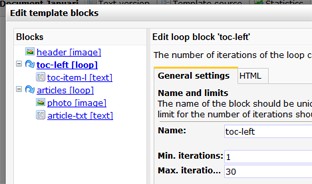

In e-mail en webtemplates kun je gebruik maken van loopblokken om
HTML-content en andere content blokken te herhalen in het document. In
het document geef je uiteindelijk aan hoevaak je het blok wilt herhalen.
In elke iteratie kan je vervolgens verschillende content toevoegen.

Een loopblok voeg je eenvoudig toe aan de HTML-broncode van een
template. Hiervoor gebruik je de code:

    [loop name="naam van het blok"]
        Deel dat je wilt herhalen
    [/loop]

Het deel dat je herhaalt mag HTML-code zijn, maar je kunt hierin ook
tekstblokken en afbeeldingblokken plaatsen.

Ook kun je loopblokken nesten door binnen een loopblok een ander
loopblok de plaatsen.

### Aantal iteraties bepalen

Hoevaak een loopblok wordt herhaald, bepaal je in het document.

-   Ga naar **Bewerkmodus**(onderaan het geopende document)
-   De loopblokken in je document zullen vervolgens aanklikbaar zijn.
-   Klik op een blok om het aantal iteraties te bewerken.
-   Klik in het dialoogvenster op de naam van het loopblok. In het
    tabblad iteraties kan je vervolgens invullen hoevaak het blok
    herhaald moet worden.

Als je binnen je loopblok ook andere blokken hebt geplaatst, dan kan je
vanuit hetzelde scherm direct de inhoud hiervan bewerken.

### Volgorde van iteraties wijzigen

De volgorde van de iteraties kan worden gewijzigd vanuit het tabblad
**Volgorde wijzigen**.

### Iteraties conditioneel tonen

Het is helaas nog niet mogelijk om condities in te stellen op
iteratiesniveau.

Extra opties voor loopblokken
-----------------------------

Er zijn diverse extra opties beschikbaar voor loopblokken.

Kies in het menu Template voor **Blokstructuur aanpassen.**Het
onderstaande dialoogvenster zal zich openen.

Tip: alle extra opties kan je ook direct in je HTML template toevoegen
en aanpassen.

### De opties:

**Naam -**Wijzig desgewenst de naam van het blok. Gebruik altijd een
unieke naam.

**Minimaal aantal iteraties -**in het document wordt het loopblok
minimaal het aantal keer herhaalt wat je hier invult.

**Maximaal aantal iteraties -**het loopblok kan maximaal X keer worden
herhaalt in het document.

Je kan dit dus ook direct in de template specificeren, op de volgende
wijze:

`[loop name="toc-left" min="1" max="30"]`

### **Inleidende en afsluitende HTML-code**

Voeg HTML toe aan het begin en het eind van een loopblok. Deze code
wordt alleen ingeladen als op documentniveau ook daadwerkelijk een blok
wordt gebruikt. Op deze wijze kan je het loopblok van speciale opmaak
voorzien, zonder de lay-out van de template te beinvloeden als de loop
niet gebruikt wordt in het document.

In het onderstaande voorbeeld krijgt elke iteratie een roze border. Deze
roze border wordt alleen getoond indien het loopblok ook daadwerkelijk
wordt getoond.

Extra (geavanceerde) opties voor loop blokken
---------------------------------------------

Net als bij een smarty foreach loop, zijn extra functies beschikbaar,
zoals *iteratie*, *index*, *first* en *last* die je kunt gebruikt om
informatie op te vragen over de items die worden herhaald.

**Let op:**op dit moment werken deze extra opties niet in smarty 3
templates. Aan een oplossing hiervoor wordt gewerkt.

-   .*index* geeft het totaal aantal iteraties, beginnend met nul
-   .*iteration* bevat de huidige loop iteratie, beginnend met nul
-   .*first* geeft de waarde true terug wanneer de huidige loop iteratie
    de eerste is
-   .*last* geeft de waarde true terug wanneer de huidige loop iteratie
    de laatste is.

Deze extra paramaters kan je bijvoorbeeld gebruiken om de inhoud en
opmaak van een loopiteratie te manipuleren.

### **Enkele voorbeelden**

Veronderstel, je hebt een loop blok [loop name="row"] die in het
document 3 keer wordt herhaald. Je kan dan de huidige iteratie opvragen
als volgt:

`[$loop.row.iteration]`

En bijvoorbeeld de eerste iteratie in een variabel zetten met de smarty
capture:

        [loop name="row"]
            {capture assign="thisrow"}
                [if $loop.row.first]
                    first, 
                [else]
                    other, 
                [/if]
            {/capture}
            {$thisrow}
        [/loop]

Wanneer je het document gepersonaliseerd weergeeft, zal dit de output
zijn:

*First, other, other,*

Geneste loops {data-mce-style="width: 600px; line-height: 20px;"}
-------------

Wanneer je gebruik maakt van geneste loops in je template (eg., loop A
en loop B), dan kan je op de volgende wijze de index van de child loop
achterhalen*:*

`[$loop.loopA.loopB.index]`
