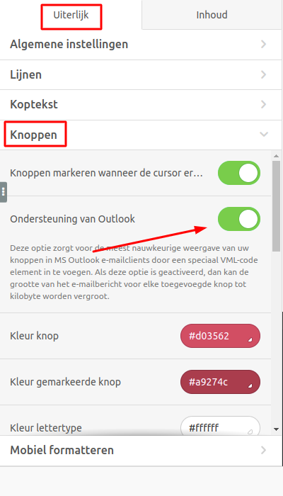
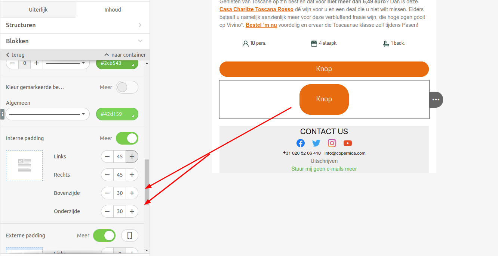
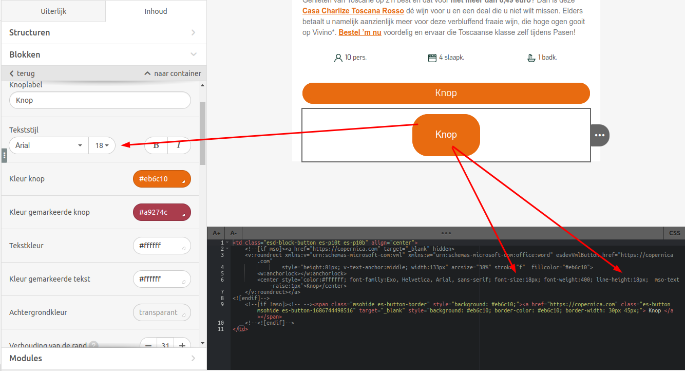

# Tips voor een juiste weergave van knoppen in Outlook

Bij het ontvangen van een opgemaakte e-mail in Microsoft Outlook kan het voorkomen dat knoppen soms niet correct worden weergegeven vanwege het ontbreken van ondersteuning voor [CSS media queries](https://www.w3schools.com/css/css_rwd_mediaqueries.asp).

In dit artikel geven we tips om de knoppen correct te tonen in Microsoft Outlook.

*Let op: dit artikel is voor de geavanceerde gebruiker van drag-and-drop-templates. Je hebt HTML-/CSS-kennis nodig.*

## Tip 1 - Gebruik de optie 'Ondersteuning voor Outlook'
De optie 'Ondersteuning voor Outlook' zorgt voor de meest nauwkeurige weergave van knoppen in Outlook.

Hoe activeer ik 'Ondersteuning voor Outlook'?
- Open een template in de [e-mail-editor](https://ms.copernica.com/#/design)
- Ga naar 'Uiterlijk -> Knoppen'
- Schakel de optie 'Ondersteuning voor Outlook' in



## TIP 2 - Houd de knopafmetingen binnen de standaardlimieten
Houd de knopgrootte beperkt tot 600px bij 200px.  
Als de tekst buiten de knop valt, kan deze gecentreerd worden weergegeven met behulp van de optie 'interne padding'.



## Tip 3 - Tekstgrootte aanpassen binnen de MSO-tags
Met MSO-tags (Microsoft Office) kun je specifieke styling voor Outlook definiëren. Deze code wordt genegeerd door andere e-mailclients.

Voorbeeld MSO-code:
```
 <!--[if mso]><a href="https://copernica.com" target="_blank" hidden>
	<v:roundrect xmlns:v="urn:schemas-microsoft-com:vml" xmlns:w="urn:schemas-microsoft-com:office:word" esdevVmlButton href="https://copernica.com" 
                style="height:41px; v-text-anchor:middle; width:163px" arcsize="50%" stroke="f"  fillcolor="#eb6c10">
		            <w:anchorlock></w:anchorlock>
		            <center style='color:#ffffff; font-family:Exo, Helvetica, Arial, sans-serif; font-size:15px; font-weight:400; line-height:15px;  mso-text-raise:1px'>Knop</center>
	</v:roundrect></a>
<![endif]-->
```

In onderstaande afbeelding wordt aangegeven waar de tekst (font-size) en regelgrootte (line-height) kunnen worden aangepast.



## Tip 4 - Gebruik een webveilig lettertype
Gebruik een [webveilig lettertype](https://www.w3schools.com/cssref/css_websafe_fonts.php) voor goede leesbaarheid van de tekst in de knop.

Als je toch een eigen lettertype wilt gebruiken, raden wij aan altijd een fallback lettertype in te stellen dat wel webveilig is. Dit lettertype wordt automatisch weergegeven als de ontvangende e-mailclient het eigen lettertype niet ondersteunt.

Een fallback lettertype kun je instellen met behulp van de CSS-optie [font-family](https://www.w3schools.com/cssref/pr_font_font-family.php):

```
<!--[if mso]>
<style>
    span, td, table, div {
      font-family: Arial, serif !important;
    }
</style>
 
<![endif]-->
```

*Let op: In sommige versies van Outlook wordt het lettertype standaard ingesteld op Times New Roman, zelfs als er een fallback is ingesteld.*

## Tip 5 - Test de e-mail in verschillende e-mailclients
Om er zeker van te zijn dat de knoppen correct worden weergegeven, is het aan te raden om de e-mail vooraf te testen in verschillende e-mailclients.
