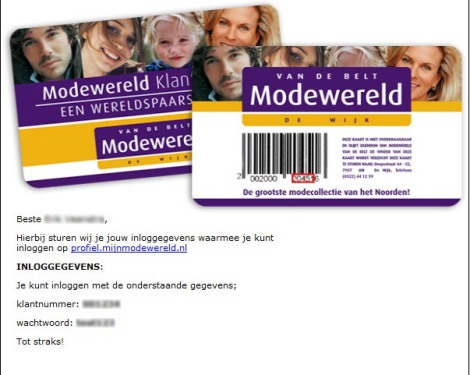
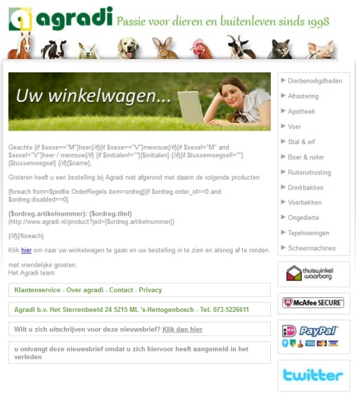

Aankoopbevestigingen, status van verzending, bevestiging van aanmelding,
abandoned shop carts. Verschillende voorbeelden van transactionele
e-mails. Dit zijn uitingen die een aankoop faciliteren en bevestigen.
Waarom is deze vorm van e-mailmarketing zo belangrijk binnen de
e-commerce branche? Omdat transactionele e-mails uiterst relevant zijn,
persoonlijk en deze worden altijd gelezen door de klant.

-   Abandoned shopcartmailings genereren tot wel 55% meer conversie dan
    reguliere e-mailcampagnes. ©SeeWhy research
-   Bevestigingsmails hebben een click-through rate van 20.8% in
    tegenstelling tot 3.1% voor bulk e-mailings verzonden door dezelfde
    organisaties. © Experian Marketing Services, The transactional email
    report
-   75% van de klanten openen en lezen transactionele e-mails in
    tegenstelling tot 45% bij andere commerciële e-mails. ©
    MarketingSherpa "Ecommerce Benchmark Guide"

Aan de slag met transactionele e-mails
--------------------------------------

Als webwinkelier maak je gebruik van een e-commerce platform. Drupal,
Hybris en Magento zijn hier goede voorbeelden van. Verstuur je een
transactionele e-mail vanuit je e-commerce platform, dan is deze meestal
nog niet opgemaakt of optimaal gepersonaliseerd. Een gemiste kans gezien
je met behulp van professionele e-mailmarketing software meer vormgeving
en gepersonaliseerde content aan transactionele e-mails mee kan geven.
Hoe werkt dat dan?

Met behulp van de datakoppeling tussen je webshop platform en je
e-mailmarketing software synchroniseer je klantgegevens. Dit gebeurt
bijvoorbeeld met behulp van een API (Application Programming Interface)
of beschikbare standaard plugins. Een datakoppeling kan automatisch
verlopen waardoor je er na installatie van de koppeling geen omkijken
meer naar hebt.

Een synchronisatie heeft naast het opmaken van gepersonaliseerde e-mails
nog andere voordelen. Hieronder enkele voorbeelden.

Voorbeeld: Modewereld - Inschrijving/wachtwoordmail
---------------------------------------------------

Dankzij de koppeling tussen de Magento webshop van
[Modewereld](http://mijnmodewereld.nl/ "Modewereld") en de
e-mailmarketing software van Copernica wordt het individuele wachtwoord
en klantnummer van iedere gebruiker opgeslagen in de centrale database.
Zodra een nieuwe klant zich aanmeldt voor de webshop, maakt de
e-mailmarketing software een nieuw profiel aan in de database. De
creatie van een nieuw profiel triggert vervolgens een opvolgactie die
een gepersonaliseerde e-mail verstuurt. Deze voegt de gewenste gegevens
aan de hand van personalisatievariabelen toe aan de e-mail en verzendt
deze vervolgens naar de klant.

Voorbeeld: Agradi - abandoned shopping cart
-------------------------------------------

[Agradi](http://www.agradi.nl/ "Agradi") maakt richting de klanten
gebruik van abandoned shopcart mailings. Hierbij staat het e-commerce
platform ook in direct contact met de e-mailmarketing software .
Producten die de klant in het winkelwagentje plaatst, komen onder een
speciale ordercollectie te staan in het profiel van de klant. "Dit is
wel uniek aan onze e-mailmarketing software .", vertelt Oskar van
Straaten, directeur van Agradi. "De gehele historie van de klant wordt
opgeslagen in de database waardoor wij alle verzamelde gegevens kunnen
gebruiken in onze e-mailings."

Uit deze ordercollectie worden de gegevens gehaald voor de invulling van
de abandoned shopcart mailing. Denk hierbij aan de achtergelaten
producten zelf, maar ook de standaardgegevens als naam en aanhef van de
klant.

Om te zorgen dat de juiste personen deze e-mail ontvangen wordt gebruik
gemaakt van een dynamische selectie. Deze selectie 'ziet' dat na 1 dag
bepaalde producten nog steeds een bepaalde status hebben
(bv. 'in shopping cart' of 'niet besteld'). De abandoned shopcart
mailing staat ingeroosterd in de e-mailmarketing software en wordt
automatisch verzonden naar alle klanten die in de selectie staan.
En dat werkt, ruim 60% van deze mails wordt geopend door de doelgroep
van Agradi in tegenstelling tot 30% van de reguliere bulkmailings.

Ga zelf aan de slag
-------------------

Beschik je over een webwinkel en wil je meer halen uit het contact met
je klant? Dan zijn transactionele e-mails hier een uitstekend hulpmiddel
voor. Je maakt zo niet alleen optimaal gebruik van de gegevens
opgeslagen in je database, je verstevigt het contact met je klant en
schept een vertrouwensband.

Werk je nog niet met transactionele e-mails? Kijk dan eens naar de
mogelijkheid om je e-commerce platform te koppelen aan professionele
e-mailmarketing software . Door onder andere de e-mailtrajecten te
automatiseren bespaar je kosten en tijd en zorg je voor een hogere
respons.

Ken jij nog voorbeelden van transactionele e-mailtrajecten of pas je ze
zelf toe? Laat het hieronder weten en vertel wat ze bijdragen aan jouw
webwinkel.

Dit artikel is eerder verschenen op Frankwatching; Transactionele
e-mails: haal meer uit je klantcontact
