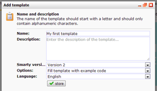
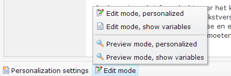

Om als nieuwe gebruiker gewend te raken met (de werking van) templates
en documenten in Copernica, kan je een volledig opgemaakte en ingevulde
standaardtemplate en -document laden in je account. In de template vind
je een aantal van de meest gebruikte technieken en tags terug, zoals een
link naar een webversie, een uitschrijflink en dynamische blokken voor
het toevoegen van inhoud op documentniveau. In dit artikel lees je hoe
je de (prehistorisch uitziende) template in jouw account laadt, en hoe
je hiermee kunt werken.

De template biedt een aardig inkijkje in wat er mogelijk is met
dynamische templates en documenten. Let op; de template heeft
ontwerp-technisch een eerder museale dan moderne uitstraling, mist
elegantie en is 'opgeleukt' met vreselijke stock fotografie. U bent dus
gewaarschuwd ;-)

De template in je account laden
-------------------------------

Templates en documenten beheer je in het onderdeel **Emailings**.

-   Kies in het menu **Template** voor **Nieuwe template...**
-   **Voer de naam in** voor de nieuwe template
-   Kies welke versie van **Smarty** je wilt gebruiken. Smarty is de
    techniek waarmee je het template document later kunt personaliseren.
    Wij raden **smarty 3** aan, omdat dit sneller en beter is.
-   Kies '**Vul template met standaard code**', en de taal waarin je de
    voorbeeldcode wilt laden in het document
-   Klik op **opslaan**.

Het document is nu aangemaakt en terug te vinden in de lijst met
templates en documenten, aan de linkerzijde van de applicatie. Klik op
het plusje bij de templatenaam om de documenten onder de template te
tonen.

Er zal minimaal 1 document \<voorbeeld\> aanwezig zijn. Klik op de
documentnaam om het document te tonen.

Inhoud van het document toevoegen of bewerken
---------------------------------------------

Het voordeel van templates is dat ze eindeloos vaak gebruikt kunnen
worden met verschillende content. Voor het toevoegen van content aan het
document kan zijn drie verschillende tags beschikbaar die je in de HTML
broncode van de template definieert.

-   **Tekstblokken** - hiermee definieer je waar tekstuele content kan
    worden toegevoegd in het document
-   **Afbeeldingblokken** - voor het toevoegen van afbeeldingen
-   **Loopblokken** - Hiermee kan je tekstblokken, afbeeldingblokken,
    HTML en zelfs andere loopblokken in je document herhalen

Het standaardtemplate is uitgerust met deze drie blokken, en in het
document lees je hoe deze verder werken.

### Inhoud bewerken

In Copernica kan je een document in twee verschillende modussen
bekijken: **voorbeeldweergave** en **bewerkmodus**. Om de inhoud van het
document te bewerken klik je in de onderste werkbalk op **Bewerkmodus**.
De verschillende blokken zullen nu klikbaar worden.

-   Klik op een blok om de inhoud ervan te bewerken.

### Webversie en uitschrijflink

In de template broncode is reeds een werkende link naar de webversie
toegevoegd. Neem gerust een kijkje in de broncode (vanuit het tabblad
HTML broncode, direct boven het document) om de zien hoe je zelf een
link naar de webversie toevoegt.

Onderin de template is ook een **uitschrijflink** toegevoegd met behulp
van de speciale {unsubscribe} tag. Deze zal nog niet werken, totdat je
de op de database het uitschrijfgedrag hebt ingesteld.

**Volgende stap:**Voorzie het document van een afzenderadres,
afzendernaam en onderwerp
