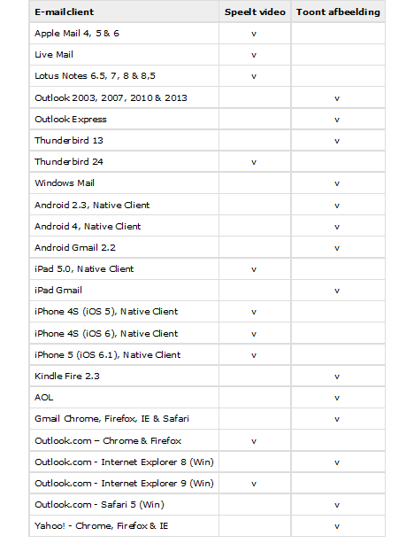

[Video in je
e-mails](http://www.marketingfacts.nl/berichten/20090910_eindelijk_mogelijk_video_in_email)
opnemen kan in principe al langer en vrij gemakkelijk maar brak nooit
echt door als trend op het gebied van e-mailmarketing. Vanwege de
opkomst van mobiel en het feit dat meer consumenten e-mails mobiel
lezen, word het in 2014 nu wel een stuk interessanter voor
e-mailmarketeers om [video in
e-mail](https://www.copernica.com/nl/blog/de-e-mailmarketinglijst-voor-2014-vijf-te-volgen-trends)
te gebruiken. Mobiele e-mailclients ondersteunen namelijk vaker en beter
HTML5, wat op zijn beurt de integratie van video in e-mail weer mogelijk
maakt.

Maar e-mailmarketeers staan nog steeds vrij huiverig tegenover de inzet
van video in e-mail. Vaak terugkerende argument is de goede weergave van
video’s in e-mailcampagnes. Velen vrezen dat de video’s niet goed worden
weergegeven in de verschillende e-mailclients.

In dit artikel laat ik graag zien met welke code je gemakkelijk video’s
opneemt in je e-mails, wat die code doet en welke e-mailclients wel of
niet video weergeven.

Waarom zou ik video opnemen in mijn e-mails?
--------------------------------------------

Omdat het zorgt voor een betere klantbeleving en voor hogere conversies
uit je e-mailcampagnes. Onderzoek heeft al aangetoond dat aanbodmails
waarbij gebruik wordt gemaakt van video ruim [278% meer
ROI](http://www.emerce.nl/achtergrond/infographic-video-email-marketing)
opleveren dan standaard e-mails. Daarnaast heeft het ook nog enkele
andere voordelen:

-   Het is weer eens iets anders. Met video in e-mail trek je sneller de
    aandacht omdat je weer eens iets anders richting je doelgroep
    communiceert.
-   Je creëert een hogere betrokkenheid met je merk omdat de boodschap
    (indien goed opgezet) persoonlijker overkomt en inspeelt op de
    interesses en voorkeuren van je ontvangers.
-   Videos kunnen ook zorgen voor een buzz. Met alle kanalen die een
    ontvanger vandaag de dag ter beschikking heeft, kan hij een video
    sneller delen wat voor instant succes zorgt.
-   De mogelijkheden zijn onbeperkt. Video in e-mail zet je gemakkelijk
    in voor diverse doeleinden. Of het nu een e-mail is waarbij je de
    laatste updates uit ‘Utopia’ te zien krijgt of een trainingsvideo
    waarin je je software kort uitlegt. Of een leuke aanbiedingsvideo.
    Het kan allemaal.

Hoe zet je video in je e-mail?
------------------------------

[Video in je
e-mail](http://www.marketingfacts.nl/berichten/20090910_eindelijk_mogelijk_video_in_email)
opnemen kan in principe al langer en vrij gemakkelijk. Simpelweg een
afbeelding toevoegen met daarachter een link naar je video en klaar.
Maar het kan tegenwoordig een stuk mooier. En dat kan dankzij
[HTML5](http://www.emailonacid.com/blog/details/C13/a_how_to_guide_to_embedding_html5_video_in_email).
Nog niet alle e-mailclients ondersteunen HTML5 video in e-mail, maar de
clients die dat wel doen ontvangen ruim 62% van alle e-mails (dat komt
dan vooral dankzij Apple).

*Hoe werkt het dan?*

Door gebruik te maken van de onderstaande HTML5 code, ben je in staat je
eigen video’s in je e-mails op te nemen. Zorg er daarbij dan wel voor
dat je ook meteen een “fallback” afbeelding instelt. Deze wordt getoond
als de e-mailclient nog niet in staat is de HTML5 video af te spelen.

    <!doctype html>
    <html xmlns="http://www.w3.org/1999/xhtml"&gt;
    &lt;head&gt;
    &lt;meta http-equiv="Content-Type" content="text/html; charset=UTF-8" /&gt;
    &lt;title&gt;Video in Email Test&lt;/title&gt;

    [literal][/literal]
    </head>
    <body>
    

      
Video Div

        <video width="320" height="176" controls>
            <source src="http://www.w3schools.com/html/mov_bbb.mp4" type="video/mp4">
            <source src="http://www.w3schools.com/html/mov_bbb.ogg" type="video/ogg">
              
        </video>
    

    </body>
    </html>

Met de bovenstaande code voeg je dus een HTML5 video toe aan je e-mail.
Als de ontvangende e-mailclient nog niet in staat is de video af te
spelen, zal deze de “fallback” afbeelding tonen. Deze kan je dan alsnog
linken naar de video of naar de webversie van je e-mail.

Hieronder vind je een duidelijk overzicht van de e-mailclients die wel
HTML5 video ondersteunen en diegenen die zullen verwijzen naar de
afbeelding.

Video in e-mail zal in 2014 een belangrijke rol gaan spelen binnen
[e-mailmarketing](https://www.copernica.com/nl/blog/e-mail-marketing-5-waardevolle-dos-donts).
Test voor jezelf zeker eens of dit voor je organisatie interessant is.
Mocht blijken dat je er nog niet klaar voor bent, kan je nog altijd
kiezen voor het alternatief. Een afbeelding gebruiken die verwijst naar
een aparte landingspagina waar de video staat. Maar ik ben benieuwd of
video in e-mail ook voor jouw organisatie interessant is. Heb je er
ervaring mee of zie je nog aanvullingen op dit artikel. Ik zie het graag
terug in de reacties hieronder!

*Dit artikel is reeds verschenen op Marketingfacts: [Video in e-mail: nu
eindelijk wel e-mailmarketingtrend van het
jaar](http://www.marketingfacts.nl/berichten/video-in-e-mail-nu-eindelijk-wel-e-mailmarketingtrend-van-het-jaar?sqr=video&)*
