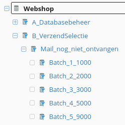
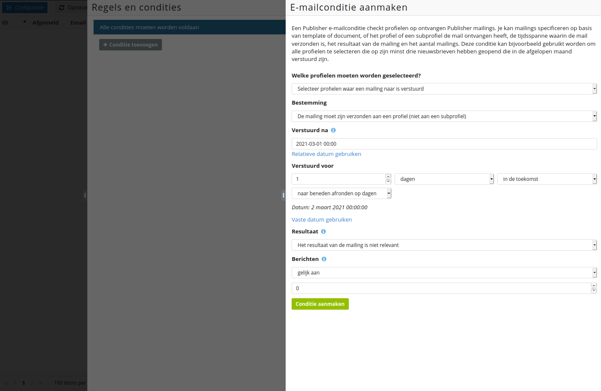
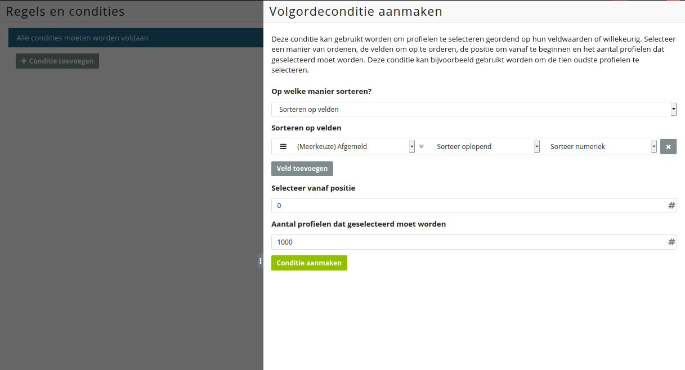

# Aanmaken van opwarmselecties

Wanneer het opwarmschema is vastgesteld zet je de desbetreffende batches om naar 
selecties. In het onderstaande voorbeeld gaan we uit van het volgende voorbeeldschema:

| Verzenddag | Volume | Aantal gemailde adressen |
|------------|--------|--------------------------|
| 1          | 1000   | 1000                     |
| 2          | 2000   | 3000                     |
| 3          | 3000   | 6000                     |
| 4          | 5000   | 11000                    |
| 5          | 9000   | 20000                    |

Het gaat daarbij om een opwarmtraject op basis van één verzending per dag.
Wanneer je opwarmschema hiervan afwijkt (bijvoorbeeld als je meerdere
batches per dag verstuurt) raden we aan om advies te vragen bij je
accountmanager.

Om te beginnen hanteren we het standaard databasemanagement. In Copernica
ziet de selectiestructuur er dan als volgt uit:

Onder **'B_VerzendSelectie'** is de selectie **'Mail_nog_niet_ontvangen'**
zichtbaar. Daarmee selecteren we alle profielen die de mail nog niet ontvangen
hebben. De opwarmselecties (inclusief het bijbehorende volume) worden hierin
ondergebracht. Dat doen we door gebruik te maken van de **'Check op
e-mailresultaten'**-conditie. Het is hierbij belangrijk dat je voor
Publisher-mailings en Marketing Suite-mailings een afzonderlijke conditie
aanmaakt.

In dit geval gaan we uit van een eerste verzending op 1 maart 2021. Om de
benodigde conditie aan te maken stel je eerst de **'Verstuurd na'**-datum
in. Deze datum gaat vooraf aan het eerste verzendmoment. Bij **'Resultaat'**
selecteer je **'Het resultaat van de mailing is niet relevant'**. Onder
**'Berichten'** selecteer je **'gelijk aan 0'**.

**Let op:** We raden het checken op een document- of templatenaam
af. Wanneer de naam van het document of template wordt aangepast voldoen
alle profielen aan deze check. Het proces is daarmee foutgevoelig. 

Binnen de **'Mail_nog_niet_ontvangen'**-selectie kunnen we nu aantallen
selecteren zonder het risico te lopen dat een profiel meerdere keren gemaild wordt.

Het selecteren van aantallen doen we met de conditie **'Sorteer en/of
selecteer profielen'**. Onder **'Sorteren op velden'** vullen we onder
**'Selecteer vanaf positie'** altijd **'0'** in. Het **'Aantal profielen dat
geselecteerd moet worden'** komt overeen met de omvang van batches in het
voorbeeldschema. Voor batch 1 is dat dus **'1000'**.

Omdat de **'Mail_nog_niet_ontvangen'**-selectie nachtelijks ververst kan
je **'Selecteer vanaf positie'** ook bij de tweede batch op **'0'** laten staan.
Het **'Aantal profielen dat geselecteerd moet worden'** zet je dan op **'2000'**.

Gebruik je een leadscoringveld waarbij een hoge score een actief profiel
representeert? Sorteer de profielen dan oplopend op basis van dat veld.
Je kunt de standaardwaarden laten staan wanneer een dergelijk veld ontbreekt.

Heb je je eerste mailing naar alle profielen verstuurd en wil je
vervolgens een tweede mailing verzenden? Dan werk je de selectie 
**'Mail_nog_niet_ontvangen'** bij. Dat doe je door de **'Verstuurd na'**-datum 
in te stellen op een tijdstip ná de verzending van de laatste batch van je eerste 
mailing en vóór de verzending van de eerste batch van je tweede mailing. 
