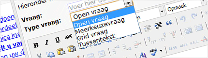

Met Copernica maak je eenvoudig en snel de best converterende
[webpagina's](./maak-zelf-slimme-e-mailings.md "Maak zelf slimme e-mailings").
Zorg voor een sterke groei van het aantal nieuwsbriefabonnees met
prachtige
[webformulieren](./verschillende-soorten-webformulieren.md "Verschillende soorten webformulieren").
Benieuwd naar je klanttevredenheid of de mening van je relatie over je
nieuwste product? Maak met Copernica in slechts enkele stappen een
[enquête](./enquetes.md "Enquête")
en ontdek wat er speelt bij je relaties.

-   [Maak en publiceer je eigen webpagina's](./maak-en-publiceer-je-eigen-webpaginas.md "Maak en publiceer je eigen webpagina's")
    ------------------------------------------------------------------------------------------------------------------------------------------------------------------------

    

    Met onze software bouw je gemakkelijk een eigen webpagina op. Maak
    zo bijvoorbeeld een leuke landingspagina ter ondersteuning van je
    laatste
    [e-mailing](./email-marketing-functionaliteiten.md "E-mailing").

    [Meer over het maken van je eigen
    webpagina's](./maak-en-publiceer-je-eigen-webpaginas.md "Maak en publiceer je eigen webpagina's")

-   [Verschillende soorten webformulieren](./verschillende-soorten-webformulieren.md "Verschillende soorten webformulieren")
    -------------------------------------------------------------------------------------------------------------------------------------------------------------------

    

    Maak met Copernica Marketing Software je eigen webformulieren en
    boost je conversie naar ongekende hoogtes.

    [Meer over de verschillende soorten
    webformulieren](./verschillende-soorten-webformulieren.md "Verschillende soorten webformulieren")

-   [Eenvoudig enquêtes publiceren](./enquetes.md "Enquêtes")
    ----------------------------------------------------------------------------------------------------

    

    Gebruik de enquêtetool van Copernica om je relaties om waardevolle
    input te vragen. Binnen enkele stappen stel je de juiste vragen en
    publiceer je jouw enquête online.

    [Meer over hoe je enquêtes kunt
    publiceren](./enquetes.md "Enquêtes")

-   [Toevoegen van een RSS of Atom feed](./gebruik-van-rss-of-atom-feed.md "Toevoegen van een RSS of Atom feed")
    -------------------------------------------------------------------------------------------------------------------------------------------------------

    

    Wil je graag je website voorzien van het laatste nieuws of je
    nieuwste producten tonen op de homepage van je webshop? Voeg dan een
    RSS of Atom feed toe.

    [Meer over het toevoegen van een RSS of Atom
    feed](./gebruik-van-rss-of-atom-feed.md "Toevoegen van een RSS of Atom feed")

-   [Resultaten van je webpagina](./resultaten-van-je-webpagina.md "Resultaten van je webpagina")
    ----------------------------------------------------------------------------------------------------------------------------------------

    

    Wanneer je webpagina online staat, wil je natuurlijk graag weten of
    hij in de smaak valt bij je relaties. Bekijk met Copernica de
    resultaten van je website en webpagina's.

    [Meer over de resultaten van je webpagina](./resultaten-van-je-webpagina.md "Resultaten van je webpagina")

