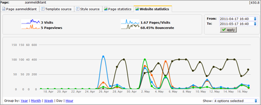

Als je een actieve website hebt, wordt automatisch het bezoekersgedrag
geregistreerd. Hier vind je ondermeer informatie over het aantal
(unieke) paginabezoeken, kliks op links en waar bezoekers vandaan komen.

De resultaten vind je terug bij de tabbladen *Pagina statistieken*en
*Website statistieken*bij de desbetreffende pagina/website in het
onderdeel *Websites*.

