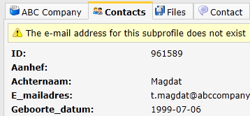
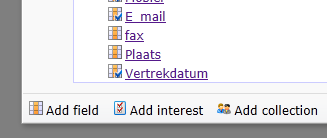

Databases in Copernica kunnen worden uitgebreid met een extra laag
gegevens. Zo'n extra laag noemen we een **collectie**.

Veronderstel, je beheert een webshop, en je hebt een database met
klanten. Bij die klanten wil je opslaan welke producten zij hebben
gekocht. Je kan dan de individuele klantgegevens opslaan in een profiel,
en de bij die klant horende producten als subprofielen in een collectie
onder het klantprofiel. Op deze wijze houd je je database geordend en
kan je deze gemakkelijk onderhouden.

-   Je kan meerdere collecties maken in een database.
-   Er is geen limiet aan het aantal subprofielen in een collectie.
-   Net als met profielen kan je selecties maken op subprofielen. Dit
    noemen wij miniselecties.
-   Een collectie wordt getoond als een extra tabblad bij het profiel.

\#\#\# Voordelen

-   Het toevoegen van collecties maakt je database beter onderhoudbaar
    en meer flexibel.

### Nadelen

-   Het importeren naar databases met collecties wordt door veel
    gebruikers als iets lastiger ervaren.
-   Dit zelfde geldt voor smarty-personalisatie met subprofielen vanuit
    een collectie.

Collectie toevoegen aan database
--------------------------------

-   Om een collectie te maken ga je naar het menu **Databasebeheer**
-   Kies hier voor **Databasevelden wijzigen...**
-   In het venster dat verschijnt vind je vanzelf de optie om een
    collectie toe te voegen.

Collectie velden
---------------------------------------------------------------

Collecties kunnen worden opgebouwd met dezelfde veldtypes die ook
beschikbaar zijn voor databases. Een uitzondering zijn interessevelden,
die alleen beschikbaar zijn in databases.

Collecties en miniselecties
---------------------------

Selecties over subprofielen in een collectie noemen wij miniselecties.
Het maken van miniselecties verschilt niet van selecties.
