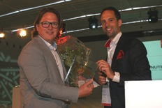

Voor het tweede jaar op rij reikt Copernica Marketing Software met trots
de Copernica Partner of the Year Award uit. Deze award is in het leven
geroepen als extra erkenning voor bureaus die zich actief inzetten in
hun rol als geregistreerd [partner van
Copernica](./get-the-most-out-of-the-partner-license.md).
Bij de uitreiking van deze award wordt gekeken naar de inzet en omzet
van Copernica partners gedurende het afgelopen jaar.

Wie volgt Redhotminute op?
--------------------------

Vanochtend zijn de 10 genomineerden bekend gemaakt (hieronder op
alfabetische volgorde). Vorig jaar sleepte Redhotminute de eerste
Copernica Partner of the Year award binnen. Wie wordt het dit jaar?
Prolongeert Redhotminute zijn titel of mogen we een nieuwe Copernica
Partner of the Year 2013 verwelkomen! Het wordt allemaal bekend gemaakt
tijdens het [Copernica
Summit](http://www.copernica.com/nl/ondersteuning/copernica-summit "Copernica Summit 2013")
op 17 september.

-   [22 Times](https://www.copernica.com/nl/partners/profile/454681)
-   [Aride](https://www.copernica.com/nl/partners/profile/2157)
-   [Bluedesk E-Business
    B.V.](https://www.copernica.com/nl/partners/profile/4537956)
-   [Bookerz](https://www.copernica.com/nl/partners/profile/4541127)
-   [Invest
    Online](https://www.copernica.com/nl/partners/profile/4540325)
-   [ISM
    eCompany](https://www.copernica.com/nl/partners/profile/4533916)
-   [LeadsOnline](https://www.copernica.com/nl/partners/profile/4465793)
-   [Perfect Groep](https://www.copernica.com/nl/partners/profile/2036)
-   [Quercis](https://www.copernica.com/nl/partners/profile/4537232)
-   [Redhotminute](https://www.copernica.com/nl/partners/profile/4463119)

\

**Waar wordt naar gekeken?**

Voor de nominaties voor de Copernica Partner of the Year Award is er
rekening gehouden met de volgende factoren:

-   Totale omzet afgelopen jaar
-   Totale omzetgroei afgelopen jaar
-   Aantal gekoppelde klanten
-   Aantal actieve accounts binnen Copernica
-   De eigen inzet van Copernica door de partner
-   Deelname beurzen of gezamenlijke seminar
-   Vermelding Copernica op eigen website
-   Aantal gezamenlijk gepubliceerde artikelen

Best newcomer 2013
------------------

Naast de uitreiking van Partner of the Year 2013, wordt dit jaar ook
voor de tweede keer de beste nieuwkomer in het partnernetwerk van
Copernica bekend gemaakt. Bij de beste nieuwkomer wordt naar de volgende
factoren gekeken:

-   Aantal gekoppelde klanten
-   Aantal actieve accounts binnen Copernica
-   De eigen inzet van Copernica door de partner
-   Deelname beurzen of gezamenlijke seminar
-   Vermelding Copernica op eigen website
-   Aantal gezamenlijk gepubliceerde artikelen

Dankzij de groei van Copernica Marketing Software in het buitenland,
kunnen we met trots melden dat een van onze Franse partners tot de
genomineerden van beste nieuwkomer behoort. De genomineerden voor de
beste nieuwkomer 2013 zijn dit jaar (op alfabetische volgorde):

-   [aYaline](https://www.copernica.com/en/partners/profile/6999374)
-   [Digitalbits](https://www.copernica.com/nl/partners/profile/4543021)
-   [Netwinst](https://www.copernica.com/nl/partners/profile/7000698)

**Wil je er ook bij zijn?**

De uitreiking van de Partner of the Year award vindt plaats tijdens het
Copernica Summit. Wil je er ook bij zijn? Je kan je [hier gratis
aanmelden!](http://www.copernica.com/nl/ondersteuning/copernica-summit/meld-je-nu-aan-voor-het-copernica-summit "Aanmelden Copernica Summit")

 
