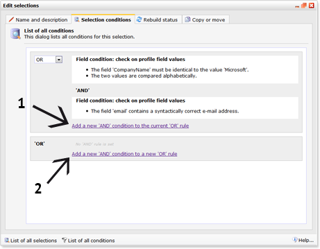
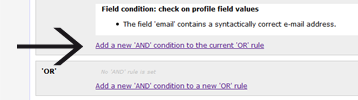
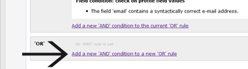
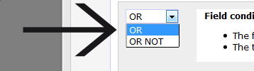

Selections can have multiple conditions. OR and AND conditions let you
determine if a profile must comply to all conditions from the selection,
or to just one of the condition(s). This allows you to create -for
example- a selection with subscribers who are male AND living in New
York. Or you can create a selection with subscribers from New York OR
from Amsterdam.

-   A selection will display all profiles that comply with the selection
    rules.
-   Selection conditions can be added to include or exclude profiles.
-   Selection conditions can be made to apply simultaneously or
    independently.

\*\**Image: \*\*Arrow 1 points to the link to add a AND condition (both
rules must comply). The other link adds a new OR condition (one of the
rules must comply).*

AND conditions
--------------

Profiles will only appear in the selection if all rules within the
current rule apply to the profile.

To create multiple selection rules which apply simultaneously, you use
the AND condition This means that you make first condition, and for the
next condition choose the line that says '*Add a new AND condition to
the current OR rule*'.

\*\* Example:\*\* You have a database with consumers and wish to make a
selection on 'football' lovers of 'London'.\
 Make a selection with two rules:

-   rule 1: Field 'City' must contain the word 'London'

**AND**

-   rule 2: Interest 'football' is applied to the profile.

OR conditions
-------------

To create multiple selection rules when a profile needs only to comply
with one of them, use OR selection. Create the first rule that may
apply, then choose '*Add a new AND condition to a new OR rule*'.

Profiles will appear in the selection if they apply to one of the rules.

**Example:** You have a database with consumers on which to make a
selection on, those who live in London or Amsterdam.

**Make a selection with two rules:**

-   rule 1 - Field 'City' must contain the word 'London'.

**OR**

-   rule 2 - Field 'City' must contain the word 'Amsterdam'.

OR NOT selection
----------------

Making a selection OR NOT will exclude profiles that comply, instead of
include

A selection can also be made in an **OR NOT** construction. Through this
method you can set rules to which a profile should comply, but by making
it 'OR NOT' those profiles will be excluded from selection instead of
included. Though the usual **AND** and **OR** rules also foresee in this
need, some cases such as selections on survey results require this
method of ruling to exclude profiles.

Combinations
------------

You can keep combining **AND** and **OR** rules to fine tune selections.

**Example:** You have a database with consumers. You wish to send a
mailing to people in London who like football and to people in Amsterdam
who like football.

**Make the following rules:**

-   rule 1a - Field 'City' must contain the word 'London'.

**AND**

-   rule 1b - Interest 'football' is applied to the profile.

**OR**

-   rule 2a - Field 'City' must contain the word 'Amsterdam'.

**AND**

-   rule 2b - Interest 'football' is applied to the profile.

