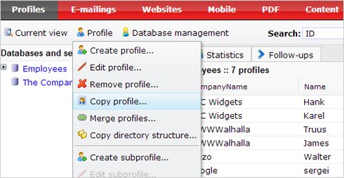
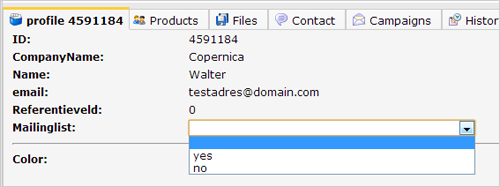
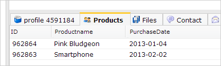

When working in Copernica, you will frequenly come across the terms
profiles and subprofiles. Both represent one set of data. The only
difference: profiles exist on database level, subprofiles exists in
**collection** level, and are always directly related to a profile.

One set of data in a database we call a **profile**. A profile can for
example represent one subscriber to your newsletter. The profile is then
used to store his email address, name, newsletter preferences et cetera.

A **subprofile** is an extra layer of data connected to a profile. For
example if your profiles are companies, the subprofiles could be people
working at that company or products purchased at that company. Each
person or product makes up for one subprofile, but you can add multiple
subprofiles to one profile.

See also: [working with database
collections](http://www.copernica.com/en/support/working-with-database-collections)

Managing profiles
-----------------

Profiles and subprofiles are managed from the *Profile* menu
under *Profiles*

Select the database, and then find the profile that you wish to edit.

### **To create a profile**

-   Click on the database to which you wish to add the profile.
-   Choose ‘**Create profile**’ from the *Profile menu.*

### **To create a subprofile**

-   Choose the profile you want to add the subprofile to.
-   Choose ‘**Create subprofile**’ from the Profile menu. Choose the
    collection to which you want to add the subprofile.

### **Edit profile / edit subprofile**

-   Select the profile or subprofile you want to edit.
-   Choose **edit profile** or **edit subprofile**from the *Profile
    menu*.
-   You can also edit the profile directly from the overview
    using *inline editing*. Click on a value to edit it.

### **Remove a profile**

-   Select the profile or subprofile
-   Choose remove profile from the profile menu. This action cannot be
    undone.

### Show profiles

-   To show the profiles from a database, click on the database name in
    the list with databases and selections
-   To show the profiles from a selection or subselection, click on the
    (sub)selection list with databases and selections

### Show all subprofiles from a miniselection

You can show subprofiles from the menu *Current view*. The function
*Show subprofiles*will call forward an overview of subprofiles in your
database or selection instead of the profile overview. When *Show
subprofiles*is activated you can search through them with the quick
search bar.

### Show the subprofiles of a single profile

If you have a collection, it will appear as an extra tab at the profile.
Click on the tab to see the subprofiles of the profile. Each row in the
list represents a subprofile. Click on a subprofile, to see its details
or to make changes to it.

