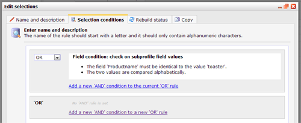
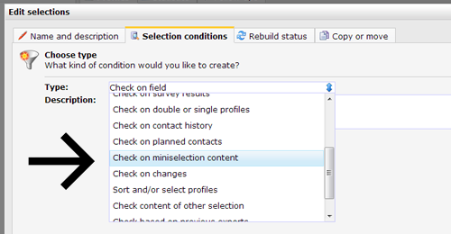
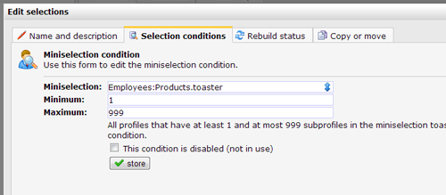
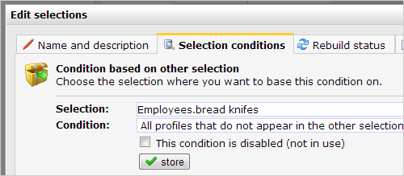

It is possible to make references between selections and miniselections.
To make these references, you use the condition types 'Check content of
other selection' and 'Check miniselection content'.

Include or exclude profiles from other selection
------------------------------------------------

With the condition type 'Check content of other selection" it is
possible include or exclude profiles from another selection. For
instance 'exclude all profiles from the selection Hardbounce', or
'include all profiles from the selection A\_Customers'.

-   Create a new condition to "**Check content of other selection**'
-   Choose the selection to which you want to refer
-   Choose whether you want to only include profiles from the selection,
    or just want to exclude those profiles.

### Oops, too many cross-references

You can only refer to selections that are on the same level as the
selection that you are editing, or to a subselection of another
selection. It is obviously not possible to refer to a selection under
your current selection, or to a selection that is based on the selection
that you are editing (are you still following?).

Selection based on miniselection
--------------------------------

The condition type 'Check on miniselection content' enables you to
select profiles that have 1 or more subprofiles that meet the rules of
the mini selection. For instance to select profiles that purchased one
or more products (stored as subprofiles).

-   Add a new condition to your selection 'Check on miniselection
    content'
-   Choose the miniselection that you want to use, and then specify how
    many subprofiles must be present at the profile.

Select all customers who have purchased a toaster
-------------------------------------------------

You want to send a mailing to customers who have previously purchased
toaster in your shop. Customers are stored as profiles, and their
purchased products as subprofiles in a collection under the profile.

-   On the collection with the products, make a miniselection 'toaster'
    with which you filter subprofiles by the product toaster. \
     
-   Then you make a selection that says that the profile has at least 1
    and up to 999 subprofiles that appear in the miniselection
    'toaster'\
      \
     
-   Store the selection. You can now schedule a mailing to this
    selection.

Select all the customers that have bought a toaster, but no bread knife
-----------------------------------------------------------------------

Suppose you want to send a mailing with a discount for a bread knive,
and you only want to approach customers who already purchased a toaster.
You obviously do not want to send the email to customers who already
have bought a bread knive.

-   You first create a mini selection 'toaster' with which you filter
    subprofiles by the product 'toaster'
-   Make a second mini selection 'bread knife' with which you filter
    subprofiles by the product 'bread knive'.
-   Make a selection "purchased toaster, no knive" which states that the
    profile has at least 1 and up to 999 subprofiles in the
    miniselection 'toaster'.
-   Then make a second selection 'purchased bread knive' which states
    that the profile has at least 1 and up to 999 subprofiles in the
    mini selection 'bread knife'
-   Add an new
    [AND](./or-and-and-selection-conditions.en.md)
    condition to the selection "bought toaster, no knife" to exclude all
    profiles from the selection 'purchased bread knive'.

-   Save the selection. You can now send a mailing to customers who have
    bought a toaster, but no knife. Customers who already have a set of
    knives will receive no mail.

