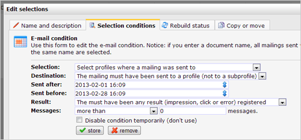

Use one of these conditions when you want to select profiles based on
the results of sent mailings

We distinguish between three condition types for

-   email campaigns
-   SMS mailings
-   fax mailings

Sent mailings include bulk mailings, transactional mails (individual
mails) and test mails. You use this selection condition, for example,
when you

-   want to send a reminder of an invitation to people who did open the
    first invitation, but have not yet clicked on the link to the
    registration form.
-   To resend a mailing to people who have not opened the first mailing.
-   To select profiles where a delivery error was registered (hard
    bounce selection).
-   To select profiles that received an SMS or fax mailing.\

Choose whether you want to select profiles to whom you sent any mailing,
or just a specific document or template.

Choose whether the recipient is a profile or subprofile.

Use the calendars to select the period in which the mail was sent. For
example, the mailing was sent between 01/01/2013 and 01/05/2013. Or use
a variable date instead: e.g. the mailing was sent 1 day ago.

### Result of the mailing

When you make a selection based on the results of an email campaign, you
select profiles or subprofiles based on their individual results. For
example, a click, impression or error must have been registered at the
profile. Note that most options listed below are only available in
conditions based on email results. The options in brief:

-   **The result of the mailing is irrelevant:**selects all profiles to
    whom the mailing was sent.
-   **Impression:**the profile has opened and viewed the email
-   **Click on link:** The profile clicked on any link or on a specific
    link in your email. Fill in the full link address or just a part of
    the link address
-   **An error was registered:** the mailing is sent, but resulted in a
    delivery error. You can register a specific error message (error
    code), in which part of the sending process the error occurred
    (error type), or distinguish between hard and softbounces.
-   **Spam complaints:**select profiles that reported an abuse

### Number of messages

Choose how many messages the profile should have had with this result.
Select more than 0 messages when the number of messages does not matter.
