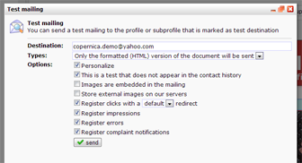
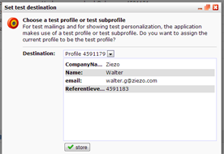

Now that you have created your first email document, you’d like to test
it, right? You can choose to send a single test mail to the test
destination, or to send a test mail to any selection in your database.

### Send a single test email

This is fairly easy

-   Select the document that you'd like to send.
-   In the menu Mailings, click **Send test mail**
-   The email is now sent to your [test
    destination](./what-is-the-test-destination.en.md)

Not possible to send the test mail? Please check the following:

-   Make sure you have set a test destination (see below this page)
-   Make sure you have [designated a database field for
    e-mail](./profiles-adding-database-fields.en.md)
-   Make sure the document has a [subject line and sender
    address](./sender-subject-and-other-email-headers.en.md)

[Did your test mail not
arrive?](./did-your-test-mail-not-arrive.en.md)

### **What is the test destination?**

The test destination is the profile or subprofile that receives test
mails. When editing an e-mail it's also possible to personalize the
preview of your e-mail with the data of this test-destination.

Please note that there is only one test destination per user. Each user
needs to set this destination for himself. It is possible for multiple
users to set the same test destination.

### **I don’t have a test destination. How do I get one?**

Under Profiles, locate the profile or subprofile you would like to use
as the test destination. Then click the button *Test destination* in the
lower toolbar at the profile.

The profile or subprofile used as test destination can best be present
in the same database you will be sending the mailings to. In this very
database, create a new profile or subprofile and use your own data for
this profile or subprofile.

It’s also possible to change the Test destination from your personal
menu in the top right corner. Click *Choose test destination...*to see
your current test destination and to modify it if wanted.\
\

**Is it possible to send a test mail to multiple persons at once?**
-------------------------------------------------------------------

Not through the regular way, because this is indeed limited to one
single address (the test destination). If you want to include multiple
addresses in your test mailing, you have to add those addresses to your
database (if they are not there already), create a selection in which
you collect the addresses, and then send a mass mailing to this
selection. If you do not want these "mass mailings" to be included in
your contact history, you can disable this in the *Options *tab in the
*Mass mailing dialog*.
