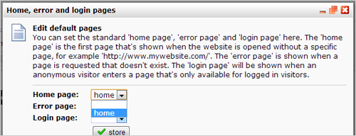

The software allows you to set which page should be displayed in
specific cases.

You can configure these pages under *Website menu \> ***Default
pages...**

-   **Home page:** This page is displayed when someone goes to the
    website without entering a specific web page, for
    instance: *http://subdomain.yourdomain.com/.*
-   **Error page:** This page is displayed when someone attempts to open
    a web page on your website that does not exist, for
    example http://subdomain.yourdomain.com/*eorighnwoernfl* (assuming
    that there is no page on your website with the
    name *eorighnwoernfl*).
-   **Login Page: **This page is displayed when someone tries to access
    a web page on your website that is accessible only to logged
    in users. On this page you can for example place a login form so the
    user is still able to login (or sign up).

