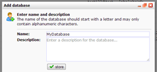
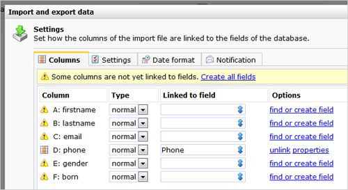

Your database with subscribers forms the base of each of your marketing
campaigns. This article explains how you create your first database, and
how you import data to your database.

**Step one: Create a database**
-------------------------------

Under Profiles, choose ‘Create database’ from the Database Management
menu. \
\
\
\
 In the dialog that appears, choose a clear and distinctive name for
your database, e.g., ‘Subscribers’ or ‘Contacts’. You may also add a
description for your database, but this is optional.

-   Hit the store button.

Your database is now created and added to the left overview. This
database is however still pretty empty. So let’s do something about
that.

**Step two: importing your contacts**
-------------------------------------

Now that you have created your database, let’s do some importing.

You probably have an Excel file with your subscribers. Great. If you are
going to send them e-mails, make sure that they have opted in for that.
You do not want to be a spammer and we surely do not want you to send
spam with our system and get us into any trouble.

**The excel file with your subscribers**
----------------------------------------

Whether your list with subscribers is exported from another application
or manually created, your Excel (or any other spreadsheet program) file
always should look something like this.

-   The file has one or more columns. The first row in your import file
    should hold the names of the columns. This is important. If you do
    not have named your columns, do that yet.
-   Each row in your import file represents one subscriber (Profile).
-   Each column contains individual characteristics of each subscriber
    e.g., email address or his or her name.  

\

**Convert the excel file to a tab-delimited file**
--------------------------------------------------

Excel files cannot be imported. Don’t worry. You just have to save it as
a tab-delimited text file first. In Excel, go to *File* \> *Save as* and
choose Text – file is tab-delimited. Excel will output some warnings
about incompatibility. Answer them by clicking ‘ok’ and ‘yes’.\
\
See
also: [http://www.howtogeek.com/79991/convert-an-excel-spreadsheet-to-a-tab-delimited-text-file/](http://www.howtogeek.com/79991/convert-an-excel-spreadsheet-to-a-tab-delimited-text-file/)

**Import the data into Copernica\
**
---------------------------------

Now that you have your file ready, you can import the data into
Copernica. This is done in a few steps. \
\
First you upload the file. Then you choose under which conditions you
want to import the data. \

-   Select the database to which you want to import the profile data. 
-   Under *Profiles*, go to *Current view* and choose *Import / Export
    data*. This will bring you to the import screen. 
-   Click *Import* 
-   Use the button to locate the import file on your computer and click
    to proceed to the next step. 

\

You will now see the column names from your import file. Click *find and
create field* for each column you want to import. Non-linked fields will
not be imported.

You may specify the properties of each field. Newly created fields are
by default normal [text
fields](https://www.copernica.com/en/support/database-and-collection-field-types).

-   Make sure that the field holding the email addresses is from the
    type *Email field*
-   For each field that you want to be displayed on the overview pages,
    check ‘ Show this field on overview pages’
-   Read more about the [available field
    types](http://www.copernica.com/en/support/database-and-collection-field-types)
    and [field
    properties](http://www.copernica.com/en/support/database-field-settings-and-options)
-   You can alter the field properties at any time

### Advanced settings

For most (first) imports, the tabs *Settings*, *Date format* and
*Notification* can be ignored. However it’s important to take the
following points into account.

-   In Copernica, dates can only be stored in database notation
    (YYYY-MM-DD hh-mm-ss). If your import file contains dates, read the
    article on [importing
    dates](http://www.copernica.com/en/support/importing-dates-with-format-conversion)
-   If you want to update (synchronize) your database with new data from
    a import file, make sure that you make use of [key
    fields](http://www.copernica.com/en/support/what-are-key-fields).
-   If your database has one or more collections with sub data, make
    sure you make use of key fields. 

You have uploaded the import file, created the fields, and gave them the
desired properties. You can now start the import.

Start the import
----------------

Hit the ‘**start import**’ button. Your file will now be imported. The
import may take some time depending of the size of your import file.

You can close the dialog safely. Doing so won’t interrupt the importing
process.\
\
When you have closed the dialog, you can view the imported data by
clicking on the database. Imported data is shown in the list view.  

-   [Create a mailing list from which unsubscribes are automatically
    exluded](http://www.copernica.com/en/support/create-a-mailing-list)

