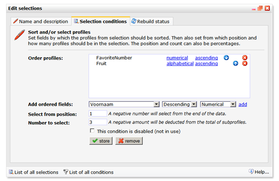

Use this condition type to alphanumeric sort and select a specified
number of profiles.

Choose by which fields the profiles from selection should be sorted.
Then specify from which position and how many profiles you would like to
have in the selection. The position and count can also be percentages.

It is advised to create an index on the field that you use for sorting.
For the best performance, it is recommended to sort on the field ID or
on numeric fields.

To see which profiles are selected with different settings, see the
examples below

-   Numeric field is ordered **ascending**
-   Selected from position 0
-   Number to select: 2

| Numeric field |
|---------------|
| **100**       |
| **200**       |
| 300           |
| 400           |
| 500           |
| 600           |

-   Numeric field is ordered **ascending**
-   Selected from position 1
-   Number to select: 3

| Numeric field |
|---------------|
| 100           |
| **200**       |
| **300**       |
| **400**       |
| 500           |
| 600           |

-   Numeric field is ordered **descending**
-   Selected from position 1
-   Number to select: 3

| Numeric field |
|---------------|
| 100           |
| 200           |
| **300**       |
| **400**       |
| **500**       |
| 600           |

-   Numeric field is ordered **ascending**
-   Selected from position 1
-   Number to select: 50%

| Numeric field |
|---------------|
| 100           |
| 200           |
| **300**       |
| **400**       |
| **500**       |
| 600           |

-   Numeric field is ordered **ascending**
-   Selected from position -3
-   Number to select: 2

| Numeric field |
|---------------|
| 100           |
| 200           |
| **300**       |
| **400**       |
| **500**       |
| **600**       |

-   Numeric field is ordered **descending**
-   Selected from position -3
-   Number to select: 2

| Numeric field |
|---------------|
| 100           |
| 200           |
| **300**       |
| 400           |
| 500           |
| 600           |

-   Numeric field is ordered **descending**
-   Selected from position 0
-   Number to select: 40%

| Numeric field |
|---------------|
| 100           |
| 200           |
| 300           |
| 400           |
| **500**       |
| **600**       |

-   Text field is ordered **alphabetical descending**
-   Selected from position 0
-   Number to select: 50%

| Textfield    |
|--------------|
| Avacado      |
| Banana       |
| Cherimoya    |
| **Durian**   |
| **Eggfruit** |
| **Fig**      |

-   Text field is ordered **alphabetical ascending**
-   Selected from position 1
-   Number to select: 3

| Textfield  |
|------------|
| Avacado    |
| **Banana** |
| Cherimoya  |
| **Durian** |
| Eggfruit   |
| Fig        |

-   Text field is ordered **alphabetical descending**
-   Selected from position 1
-   Number to select: 3

| Textfield  |
|------------|
| Avacado    |
| **Banana** |
| Cherimoya  |
| **Durian** |
| Eggfruit   |
| Fig        | 

Multiple profiles have same value in numeric field different values in
text field

-   Numeric field is set to prior
-   Profiles with 100 will be selected and sorted alphabetically
-   Profiles with 200 will be selected and sorted alphabetically
-   Profiles with 300...

| Numeric field | Text field  |
|---------------|-------------|
| 100           | Avacado     |
| 100           | **Banana**  |
| 100           | Watermelon  |
| 200           | **Avacado** |
| 200           | Banana      |
| 300           | Avacado     |
