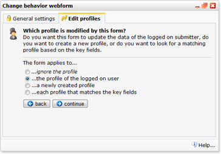
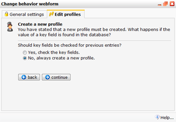

Web forms have lots of different uses and purposes, which is determined
in the web form behaviour. Using the *Content web form*behaviour wizard,
you tell the web form how it should deal with submitted data. Should it
always create a new profile, or should it look for a matching profile
first, and only create a new profile if no matches where found. What
should happen if multiple matches are found?

*The web form behaviour can be configured in the web form setting
dialog.*

*Web form \> **Edit settings***

Click to the **Edit profiles** tab. Hit the Change behaviour button to
start the wizard.

\
**\
 Let’s take a closer look at the behaviour wizard.** **The first step in
the wizard lets you determine to whom the web form should apply. Four
options can be found here.**

### 1. Ignore the profile:

No changes should be made to profiles in the selected database when the
form is submitted. This option is useful when the submitter of the web
form is subprofile, and should not be able to change data in the
profile.

**Example:** the submitter is an employee (subprofile) of a company
(profile). He or she should not be able to change the company name.

### 2. The profile of the logged on user

The form will only function if a contact reaches the page already logged
in. That way it is known who is filling out the form, either because
he/she logged in on an earlier page or is clicking on a personalized
hyperlink in an e-mail.

The form can be prefilled with the contacts' known information.

### 3. A newly created profile

The form will only function from a 'new contact' situation. It is
assumed the contact is not yet known. On submitting the form, a new
profile will be created.

### 4. Each profile that matches the key fields

The form will function both for new contacts and known profiles. When
submitted, the form checks the database to see if the contact already
has a matching profile. If so, the profile is updated. If not, a new
profile is created.

Depending to whom the web from should apply, you will be presented with
different options in the next steps in the wizard.

### Multiple matches are found

Choose what should happen if multiple matches are found (duplicate
profiles). Whether all found profiles should be modified or only the
first found profile. Default value is one (only one profile is
modified). Set the option to zero if all profiles should be modified.

**Also a collection?**\
 If you are using a collection with added information to your database,
please proceed to the **Collection settings**tab. Or **continue**to add
fields to the form.

**Update or removed?**

Should the data from the profile or subprofile be updated with the
submitted data or should he or she be (irretrievability) removed from
the database?

### Check on key fields

In the web form, you can designate a key field or multiple key fields
that the web form can use to look for matches (existing profiles) in the
database. When a match is found, the profile is updated or removed from
the database. If no match is found, a new profile will be created, or an
error message will be displayed. This way, you can prevent that
duplicate profiles end up in your database or collection, or allow your
contacts to edit their own data.

### Example web forms

-   [Newsletter subscribe
    form](http://www.copernica.com/en/support/newsletter-sign-up-form)
-   [Unsubscribe form - profile will be removed entirely from the
    database](http://www.copernica.com/en/support/unsubscribe-form-remove-profile-entirely)
-   [Change web
    form](http://www.copernica.com/en/support/create-change-web-form)
-   [Login
    form](http://www.copernica.com/en/support/login-logout-and-forgot-password-form)

