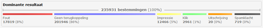

The dominant results of a mailing
=================================

This chart provides an overview of the statistics for each mailing. This
chart only displays the **DOMINANT** result. That means that if a
subscriber has both registered for an impression and a click, only the
click is counted on this view. Thus, the green box represents the number
of destinations where a click was registered as the dominant result, not
the total number of clicks.

#### \
**Error (bounces)**

The mailing has triggered an error somewhere in the delivery process.
Check the **errors** tab to see what error and in what stage it
occurred.

#### **No response** (no activity registered)

The software was not able to register a response from the subscriber.
Simply put: we don ’t know what happened with the mail. He or she may
have blocked the return of results, discarded the e-mail without opening
it or there may be other causes that we cannot determine.

#### **Impression**

See how many subscribers opened your mailing (but did not click on a
link).

#### **Click**

See how many subscribers clicked on a hyperlink in your mailing. Clicks
on {unsubscribe} links are not included in this figure. See below.

#### **Unsubscribe**

Represents the number of unsubscribes in your mailing. They have clicked
on the {unsubscribe} link.

#### **Complaint**

Represents the number of subscribers from whom we received a complaint
about your email. They may have reported it as spam, or reported an
abuse otherwisely.
