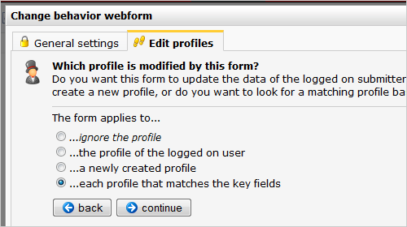
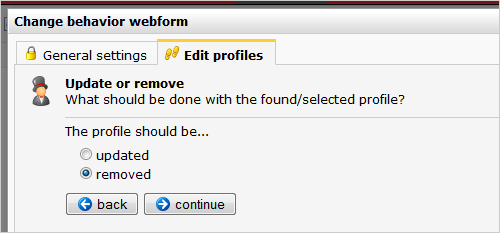
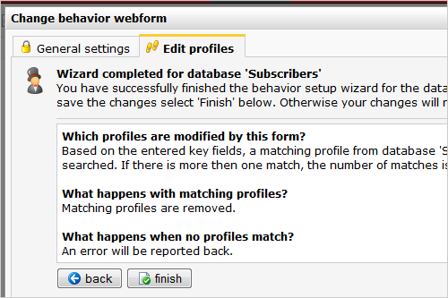

If I unsubscribe from a mailing list, I find it good to know that my
personal data will be removed from the database entirely. For privacy
reasons. After all, what’s the use of keeping my data if I only ever
signed up for a newsletter? This article describes how to make the
unsubscribe form that erases the profile entirely.

**Note:** if you use the {unsubscribe} tag in your emailings, then you
do not need to create a web form. You only need to adjust the [database
unsubscribe
behaviour](./setting-unsubscribe-behaviour-for-your-database-or-collection.en.md).

Creating the webform
--------------------

Create the form, and link it to the database

This webform only needs one field: the email address. Make this field a
key field.

-   Store the field and go to Webform \> Settings... to further
    configure the form.
-   When you're finished the **setting the General**, open the **Edit
    profiles** tab to adjust the webform behaviour wizard.

-   Who will be modified by this form?...each profile that matches the
    key fields (the e-mail address)

-   If there are multiple matches (ig. you have duplicate email
    addresses in your database), they should all be removed. Otherwise
    someone that appears double in your database would keep receiving
    your emails until he unsubscribed 2 times. Set it to 5 or higher.

-   Here is where the magic takes place. Choose to **remove**the
    profile.
-   Walk through the rest of the wizard. These settings are optional.

-   When you completed the wizard, it should look something like this.

The web form should work now. Publish it on your webpage using the tag
`{webform name="name of your form"}` and test it out!
