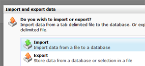
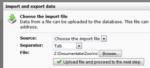
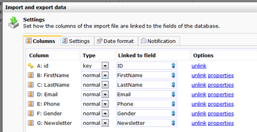
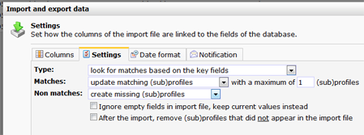
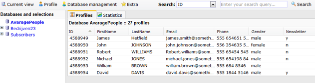

This article will guide you through the process of updating a database
in the marketing software with an import. If a row from the import file
can be linked to a profile in your database, the profile will be
updated. When there is no match, a new profile will be created.

**NOTE:** With this type of import you can affect all existing data at
once. This action cannot be undone. You should therefore perform the
import with great caution and double check your settings carefully
before you start importing.

### Step 1: creating and uploading the file

-   Create your import file, and [convert it to a tab delimited txt
    file](http://www.howtogeek.com/79991/convert-an-excel-spreadsheet-to-a-tab-delimited-text-file/).
-   Under Profiles, **click on the database** that you want to update
    with the new data.
-   Choose **Import / Export files**from the **Current view**menu. In
    the dialog screen, click **Import**.

-   **Locate the import file** on your computer, and **proceed to the
    next step.**

### Step 2: linking the fields, choosing the key field

The import dialog has four tabs. The **columns tab**allows you to link
the columns from the import file to the database fields in your
database.

**Note:**If the column names from your import file match with database
field names, they are automatically linked. If they do not match, you
can link them manually.

You can create missing database fields directly by clicking on the
'**find or create field**’ button. A [text
field](./database-and-collection-field-types.en.md)
will be created in the database. Click **Properties** to make the field
with the desired settings. You may of course alter these settings at a
later time from the*Database Management menu \> **Edit fields**.*

**Note:** Data from non-linked fields is not imported. It is not
required to link all fields.

If no fields were found, create them individually or at once by clicking
on **Create all fields**.

#### Key fields

To synchronize data, you need to set [key
fields](./what-are-key-fields.en.md). The
key field must contain a unique value, needed by the application to link
the import rule with an existing profile. If you do not have a field
with unique values, it is possible to use more key fields which are
combined unique. Fields suitable for key fields include the profile ID,
a customer number or the recipients email address.

Key fields are chosen manually. The application warns you if no key
fields have been set yet.

In the example below, the field ID is designated as key field.

the fields are now linked, the system field ID is set as key field.
Continue with the settings.

### The import settings

Proceed to the *Settings tab*to tell the application what to do when a
match is found based on the key field(s).

-   At type choose '**search for matches based on key fields**'

This method of import connects the imported data to your existing
profiles. When selected, several options are available:

**Matches: Update matching profiles with a maximum of [value]
(sub)profiles**\
 If a match is found between the imported data and a profile in the
database, the imported data can be used to update the profiles or the
imported data can be ignored. If you set the maximum to 1, only one (the
first) match will be updated.

For most imports, the default synchronize settings are sufficient.

**Non-matches: create or ignore\
**If NO match is found between the imported data and the database, a new
(sub)profile can be created from the import or that information can be
ignored.

**Ignore empty fields in import file, keep current values instead\
**Check this option if you wish to only update your database with new
data, without the risk of losing data.

#### Date Format

If you get a warning about non-compatible dates in your import file,
refer to the article about [importing dates with format
conversion](./importing-dates-with-format-conversion.en.md).

#### Notification

If desired, you can get set that an email notification should be sent
once the import is finished.

### Step 3: start the import

When everything is set, you can start the import. The file is imported
immediately. Mind you, the time it takes depend on the size of the
import file. You can close the dialog while the import is running. This
does not affect the import.  

Click **Start Import** to start importing. Once the import is completed,
click on the database to make sure you see it with the new and updated
data.

New contacts with avarage names are now added to the database
AvaragePeople. James Smith changed his name to James Hetfield. This
record was updated in this import.  
