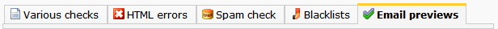
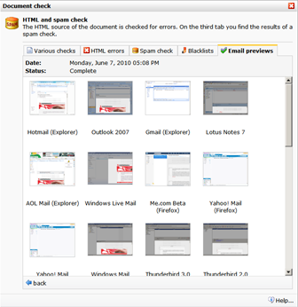
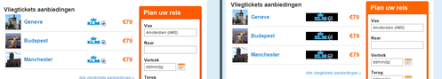

It can be very tedious to make your email design look good in every
possible email client such as Outlook, Hotmail, Gmail and Lotus Notes.
Particularly the testing for these clients on different platforms can be
a very time consuming process.

Not anymore. The Litmus email preview shows you screenshots of your
email newsletter as it looks across all major email clients including
Hotmail, Yahoo and Outlook Express and in the most common internet
browsers, such as Firefox and Internet Explorer.

### A Litmus test can be started

> By clicking on the **View document in various clients** button in the
> toolbar below the document.

\*\*Note: \*\*a small fee is charged for a litmus email preview.

Starting a test
---------------

To start a test, click on the ‘*Start test*’ button. In the dialog you
can choose if you want to receive an email notification when the testing
results are ready. It may take some time before all testing results are
ready, because the emails are literally sent to these clients to
generate the screenshot.

\*\* The previews are generated for:\*\*

-   Hotmail (Explorer/Firefox)
-   Outlook (2000, 2002 XP, 2003, 2007, 2010 beta)
-   Gmail
-   Lotus Notes (6.5, 7, 8)
-   Apple mail
-   me.com (Firefox, Explorer)
-   Gmail (old/new, Firefox/Explorer)
-   Windows live mail
-   AOL (Firefox/Explorer)
-   Thunderbird (3.0, 2.0)
-   Yahoo! mail (3.0, 2.0)

The static testing results will remain available for future reference.
Even after you’ve made changes to your email document.

\#\#\# Charge per test

We advice that you use this tool for final testing when the document or
template is completely ready for sending, because there is a (small)
charge involved with its use. However the charge should not stop you
from using this tool, because the most important thing is that your
email will look good for every recipient. Please contact Copernica BV to
ask how the email previews are charged (5 euro per test).

Question and answer
-------------------

\*\*Q. Some images appear with a black background color in the tests.
See image: \*\*

\*\*A. \*\*The image in question is most likely a GIF with transparancy.
It's the transparent part of the image that's appearing black in the
Litmus screenshot, and white (transparent) in your local copy of
Outlook. What you're seeing on Litmus' screenshot is an accurate
depiction of what some of your recipients using Outlook would see.

It is recommended not to use transparancy in your images because it is
poorly supported in some email clients.

 
