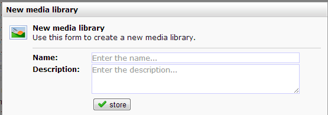
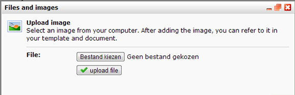

The marketing software allows you to centrally organize and manage files
and images using media libraries.

Files and images uploaded to a media library are available for use in
templates, documents, web forms and any other publication created with
the software:

-   Emailing templates and documents
-   Website templates and web pages
-   RSS and Atom feeds
-   Surveys
-   Content web forms

The media libraries are found in Content module, next to Feeds, Surveys
and Web forms. Existing Media Libraries can be selected from the left
tree menu. Media libraries are especially useful for those images and
files used on a regular base in different templates or different content
types, such as RSS feeds and web pages. Think of a company logo or a
privacy statement in PDF format.

Creating a new library is fairly easy. Go to the content module and
click on ‘New media library’ from the Media library menu. Give your
library a nice name and a (optional) description. Click on store.

Your newly made empty library is displayed immediately. Click on ‘Edit
files and images’ to start adding your first images and files.

Use 'add image' to add one image or multiple images from a zip archive
to your image library. Image types suitable for usage in online
campaigns are .jpg, .png and .gif

Use 'add file' to add one file or multiple files from a zip archive to
your files library.  You can store any type of file in your media
library. The **maximum size** of a file is limited to 150 mb per file. 

**Filenames **can be edited using the edit name function.

Files and images can be downloaded to your hard drive. If multiple files
are selected, the files will be stored in a zip archive. This zip
archive can be unpacked using WinZip (or any other archive software
package. See list
[here](http://en.wikipedia.org/wiki/Comparison_of_file_archivers "List on Wikipedia"))
or by right clicking on it in Windows Explorer, then click ‘extract
files here’ from the menu).

Using your media library in templates, documents and web pages
--------------------------------------------------------------

All images and files from any library created under Content are
accessible in any publication using the "medialibraryname/imagename"
syntax. Thus, if you have a media-library named "MyLibrary", and in that
library there an image "logo.gif" exists, you can use the
"MyLibrary/logo.gif" in every publication, without first linking the
media library.

**Images and files from a library can be used the same way as the files
and images directly belonging to the template or document.**

-   From the Rich text editor by clicking on the 'add image' button
-   From the image block editor
-   By using HTML in the sober editor or HTML template source by
    refering to its relative path:

