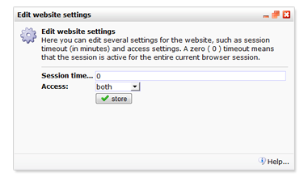

For each website you can set whether it should be accessible only via
https, http or both and how long session cookies are stored. These
cookies allow visitors to stay logged in for the duration that you
specify here (in minutes).

Website settings can be found in the **Website menu**.

### Session time-out settings

Specify the time-out period assigned to a session in your website. If a
user does not refresh or request a page within the set time (by default
0), the session ends.

For example, if a logged in user doesn't use your website for 1 minute,
he will be automatically logged out.

A zero ( 0 ) timeout will make the session active for the entire current
browser session. Only after the visitor closes his browser, the session
ends.

### HTTPS Access

Hypertext Transfer Protocol Secure (HTTPS) is a combination of the
Hypertext Transfer Protocol with the SSL/TLS protocol to provide
encrypted communication and secure identification of a network web
server ([read article on
Wikipedia](http://en.wikipedia.org/wiki/HTTP_Secure)).

You can choose between http only, https only, or both. Your website
visiotor will be redirected if needed. If the site setting requires a
SSL connection and the visitor requests the site using http, he will be
redirected to the secure version.

If you use your own domain (host name), some [extra steps are required
for using
SSL](https://www.copernica.com/en/support/your-website-in-copernica-through-secure-https).
