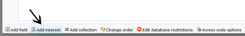
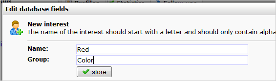
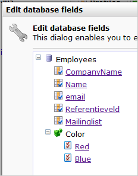

An interest field is a special kind of field that allows only two
values: checked or unchecked. It is used mainly for listing interests
and preferences of contacts, hence the name. For example an interest
field could be 'newsletter' - yes/no.

Note: interest fields are only available in databases, NOT in
collections.

### Group name

Interests that are linked to each other can be grouped. For example if
you have interest fields for football, basketball and tennis they can be
grouped under 'sports'.

Enter the interest under *'Name'*. '*Group name*' is optional. 'Current
Group' allows you to choose a group from the existing list. When adding
or editing a profile, a user can check or uncheck the interest.

### Create interest field and group

​1. Find 'n click the button **Add interest**in the *Edit field dialog*.

​2. Enter the name of the new interest field, and optionally create a
new group (or select an existing group if available). Then click store.

​3. The interest is now created (note: the image below shows two
interest fields in the group Color: Red and Blue.

### Web forms

In Content webforms, interest fields are shown as checkboxes (checked in
'yes', unchecked is 'no'). You'll find the option to add an interest
field to your webform in the Add field dialog at your web form under
Content.

### Interest fields and smarty personalization

An interest is different because it knows only two values: yes and no.

For example the interest football would be used as `{$profile.football}`

A smarty condition based on an interest field will look something like
this:

`{if $profile.football=="yes"}show this text{elseif $profile.baseball=="yes"}show this text{else}show this text{/if}`
