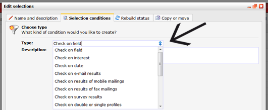
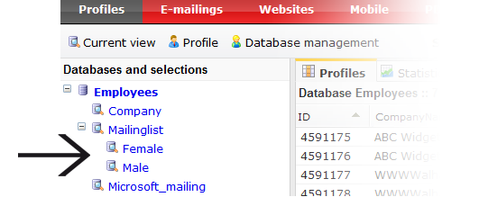

With database selections you're able to make segments in your database.
Use selections to optimize the quality of the data in your database and
to easily set up targeted campaigns. Because Copernica automatically
processes all changes in your databases, your selections are always up
to date.

**To add and edit selections:** Select a database under Profiles, and
then choose *Edit selections* from the *Database management* menu.

### What is a selection exacly?

A selection is a filter on the information in your database. It filters
focus groups for insight in your database or to send targeted mailings.
A selection can be made on profiles (selection), subprofiles
(mini-selection) or on another selection
([subselection](http://www.copernica.com/en/support/creating-subselections)).
It can contain several filters that apply together ([AND
conditions](http://www.copernica.com/en/support/or-and-and-selection-conditions))
or look at separate conditions including both (OR conditions).\
 \
 Others call it *segments*, *lists*, *queries*. We however use the terms
*selections*and *mini-selections*.

Under Profiles, your selections are displayed as a sublevel of a
database. Which profiles it will contain is defined by **selection
rules**. Selection rules can create virtually any type of selection. If
a profile fits into these rules (conditions), it will be shown in the
selection.

A selection is always current. Each time the rules are edited and
several times a day the selection is rebuilt. So if you change the
address of a contact, it will be added or removed from the selection
within a few hours. [Read more about selection
rebuilding](http://www.copernica.com/en/support/how-are-selections-re-built)

Selection condition types
-------------------------

When creating selections, you have various conditions types to choose
from. Each condition type has its own way to filter data. Example, you
can filter on the values ​​in database fields (check on field value), or
you can select profiles that have been created or modified in the last
two weeks (check on change). You can add as many conditions as you like
and in endless combinations.

Common selections
-----------------

The possibilities with selections are endless. Here are a few common
applications:

-   [A mailinglist
    selection](http://www.copernica.com/en/support/create-a-mailing-list)
    - unsubscribes are automatically filtered from your newsletter
    selection
-   [Automatically process
    bounces](https://www.copernica.com/en/support/automatically-process-bounces)
    - profiles with a recurring delivery error are automatically
    filtered from your mailing list(s)
-   [Filter duplicate
    addresses](https://www.copernica.com/en/support/how-do-i-remove-duplicate-contacts-profiles)
    - Email addresses that appear double in your database, can be
    automatically excluded from your mailing list
-   [Birthday
    selection](http://www.copernica.com/en/support/how-to-create-a-birthday-selection)
    - See who's birthday it is today (and send them a nice greeting)

View the profiles in a selection
--------------------------------

You can view a selection by clicking on its name from the *Databases and
selections* overview under Profiles. You may also use the *Show
subprofiles* function from the Current view menu to show the subprofiles
from a miniselection.

### Can I remove a selection without losing data?

A selection is just a filter on your data. Removing a selection will not
remove the profiles from the selection.

To remove the profiles from a selection, you can [edit/remove multiple
profiles](https://www.copernica.com/en/support/edit-or-remove-all-profiles-from-a-database-or-selection-at-once)
from the Current view menu.

In short
--------

-   A selection is an active filter on your database
-   A miniselection is an active filter on the data in a database
    collection
-   Selections can consist of one or more rules (conditions). You
    determine if the profiles in the selection must comply to all rules
    or to one of the rules (OR and AND conditions)
-   Filters can be nested, meaning that you can create selections on
    selections: subselections
-   You can create as many selections as you like.

