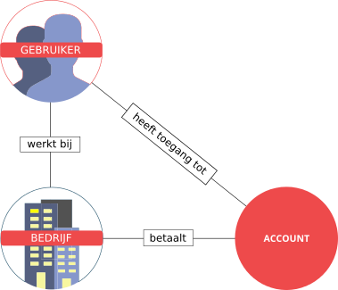

# Accounts en gebruikers

Het kan voorkomen dat je op een bepaald moment je gegevens wilt wijzigen.
Denk bijvoorbeeld aan je bedrijfsnaam of je inloggegevens. Je kunt dit 
gemakkelijk doen in het gebruiksbeheer van SMTPeter. 
Tegelijkertijd kun je ook nieuwe inloggegevens aanmaken en bepalen wie 
toegang heeft tot een bepaald account. 

De interface is gebouwd met inachtneming van het feit dat dat SMTPeter 
veelal wordt gebruikt door bedrijven die namens andere bedrijven e-mail
versturen. In dit geval is het verstandig om een account aan te maken voor 
elk bedrijf waar e-mail voor verzonden wordt. Aan elke account kun je dan 
weer gebruikers toevoegen met verschillende toegangsrechten. In het 
gebruikersbeheer van SMTPeter is daarom onderscheid gemaakt tussen 
"gebruikers", "accounts" en "bedrijven".

In onderstaande driehoeksverhouding is te zien dat meerdere constructies
opgezet kunnen worden. Een partner kan bijvoorbeeld een account aanmaken
en daarvoor betalen door middel van een Copernicalicentie. Vervolgens 
kunnen de medewerkers van een partner ook toegang krijgen tot het account.
Het is ook mogelijk om een extern persoon toegang te verlenen tot een 
account. Dit soort relaties maak je gemakkelijk aan in het gebruiksbeheer, 
waar alles overzichtelijk wordt gepresenteerd.

