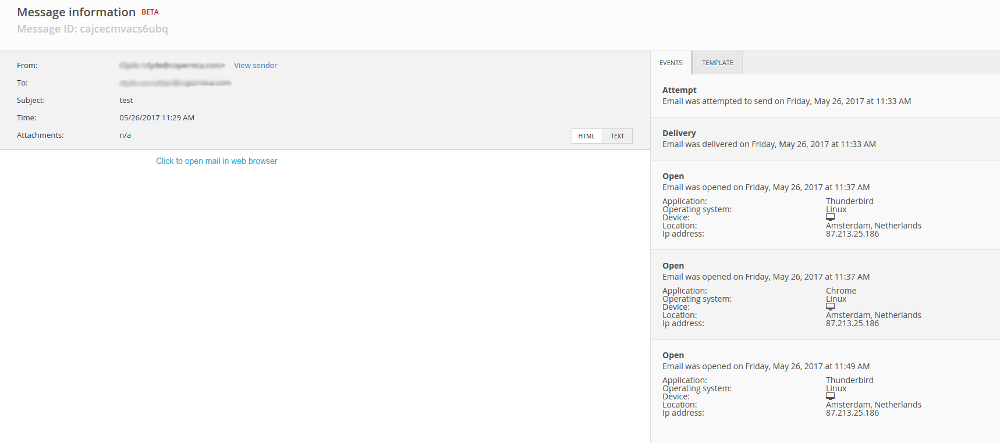

# Logfiles in SMTPeter

SMTPeter houdt een log bij van alle verzonden emails. We houden 
informatie bij over *events*: deliveries, bounces, clicks, pogingen 
om af te leveren, et cetera. Deze *logfiles* kunnen worden opgehaald 
door middel van een 
[REST API call](./rest-logfiles), 
maar SMTPeter heeft er ook een interface voor; je vindt hem 
onder het tabblad 'Operations Log' in het linkermenu.

In de Operations Log kun je de logfiles van verzonden berichten inzien 
van een specifieke dag. De bestanden zijn opgedeeld per soort logfile (click, delivery, 
etc.). Wanneer je klikt op een categorie, zie je de mailings van die dag 
aangegeven met hun *destination ID* en andere informatie. 

## Message information

Klik op de destination ID voor gedetailleerde informatie over de e-mail. 
In dit scherm, 'Message information', vind je alle details van de mailing. 
Zo kun je de content zien, de ontvanger, het onderwerp en de bijlagen.

Daarnaast vind je twee tabbladen genaamd 'Events' en 'Template'. 'Events' 
bevat informatie over pogingen, afleveringen, clicks, opens, en meer. Je 
kunt hier bijvoorbeeld precies zien wanneer de ontvanger jouw bericht 
heeft geopend, op wat voor device en op welk besturingssysteem. 

Onder 'Template' staan gegevens over het template, zoals de ID en in 
hoeveel mailings het template gebruikt is.

## Downloaden van logfiles

Je kunt logfiles downloaden door middel van de knop 'Download' in het 
overzicht van logfiles, maar je kunt ze ook ophalen door middel van de 
[REST API](./rest-logfiles), 
of je kunt notificaties krijgen van events door middel van 
[WebHooks](./webhooks).

## Meer informatie

* [Achtergrondinformatie](./background)
* [REST API](./rest-logfiles)
* [WebHooks](./webhooks)
